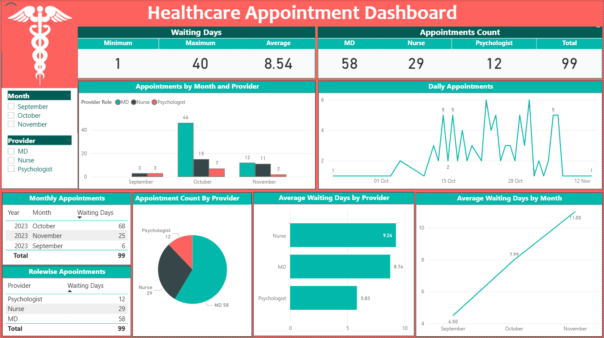

# 🏥 Healthcare Appointment Scheduling Dashboard (Power BI)





## 📌 Project Overview

Efficient appointment scheduling is critical in healthcare to ensure timely patient care and optimal utilization of providers. However, challenges such as long waiting times, uneven workload distribution, and fluctuating demand can impact service quality.

This project presents an interactive **Power BI dashboard** built on healthcare appointment data to analyze:

* Appointment trends
* Provider workload distribution
* Patient waiting time

The dashboard enables data-driven decision-making to improve operational efficiency and patient experience.

---

## 🎯 Objectives

* Analyze appointment patterns over time
* Evaluate provider-wise workload (MD, Nurse, Psychologist)
* Measure and monitor patient waiting time
* Identify bottlenecks and inefficiencies

---

## 🧹 Data Cleaning & Transformation (Power Query)

The following steps were performed to prepare the dataset:

### **1. Import Data into Power BI**

* Loaded the healthcare appointment dataset into Power BI Desktop

### **2. Data Transformation**

* Opened **Power Query Editor** to clean and transform data
* Checked for missing values and ensured correct data structure

### **3. Change Date-Time Format Using Locale**

To correctly format date fields:

* Right-click on the date column
* Select **Change Type → Using Locale**
* Set:

  * **Data Type** → Date/Time
  * **Locale** → English (United States)

This ensures consistent date parsing and avoids format issues.

### **4. Create Waiting Time Column**

A new column was created to calculate waiting time:

```DAX
waiting_days = Duration.Days([End_date] - [Start_date])
```

* This calculates the difference between appointment booking date and appointment completion date
* Used for waiting time analysis across providers and months

---

## 📊 Dashboard Features

### **🔑 KPI Cards**

* Minimum Waiting Time
* Maximum Waiting Time
* Average Waiting Time
* Total Appointments
* Provider-wise Appointment Count (MD, Nurse, Psychologist)

---

### **🎛️ Slicers (Filters)**

* Monthly Filter
* Provider Role Filter

These allow dynamic and interactive data exploration.

---

## 📈 Visualizations

### **1. Clustered Column Chart**

* Displays **month-wise and provider-wise appointment counts**
* Helps identify demand trends and workload distribution

### **2. Line Chart (Daily Appointments)**

* Shows **daily appointment counts**
* Highlights peak and low-demand days

### **3. Pie Chart (Provider Distribution)**

* Displays **appointment share by provider role**
* Helps evaluate workload balance

### **4. Tables**

* **Monthly Appointments Table** → Detailed monthly counts
* **Provider-wise Table** → Appointment distribution by role

### **5. Horizontal Bar Chart**

* Shows **average waiting days by provider**
* Identifies delays and inefficiencies

### **6. Line Chart (Waiting Time Trend)**

* Displays **average waiting days by month**
* Tracks performance over time

---

## 🔍 Key Insights

* Appointment demand varies across months and days
* Workload distribution among providers is not always balanced
* Certain provider roles experience higher waiting times
* Waiting time trends highlight operational inefficiencies

---

## ✅ Conclusion

This dashboard provides actionable insights to:

* Optimize appointment scheduling
* Improve provider utilization
* Reduce patient waiting time
* Enhance overall healthcare service delivery

---

## 🚀 Tools & Technologies

* **Power BI Desktop**
* **Power Query (ETL)**
* **DAX (Data Analysis Expressions)**

---

## 📎 How to Use

1. Download the `.pbix` file
2. Open in Power BI Desktop
3. Use slicers to explore data by month and provider role
4. Interact with visuals for deeper insights

---

## 📬 Contact

If you have any feedback or suggestions, feel free to connect (hsvyas4u@gmail.com)!


